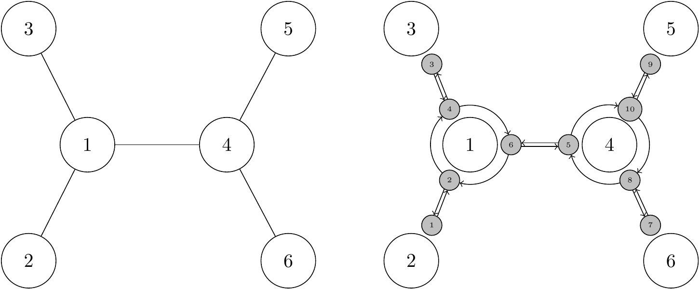

# OTrees

[](https://github.com/eascarrunz/OTrees.jl/actions/workflows/CI.yml?query=branch%3Amain)
[](https://codecov.io/gh/eascarrunz/OTrees.jl)

> 🚧 Work in progress

This package implements a tree data structure that is "unrooted", but also "rooted" at the same time. Nodes have *views*, one coming from each neighbour. The node views represent the root of a subtree.

This kind of data structure is useful for phylogenetic maximum likelihood algorithms and branch swapping economies (Felsenstein 2004, p. 589). Very similar data structures are used in Phylip and the Phylogenetic Likelihood Library used in RAxML. However, the data structure is complex, and difficult to use in interactive programming. The goal here is give an interface that takes care of the most fiddly bits for the user. Traversing the tree is made easier with iterators for neighbour and children nodes.

## Structure



On the left there is a simple unrooted tree with 4 *outer* nodes and 2 *inner* nodes, all nodes numbered from 1 to 6. On the right there is a diagram of the `OTree` data structure that represents the same tree. That structure can be created with a function that grows symmetric trees.

```julia
# The argument passed to this function is the "radius" of the tree (it needs a more precise definition)
tree = symmetric_tree(2)
```

The white circles are `ONodes`, which represent the nodes of the tree and are numbered in the same way.

The smaller grey nodes are `NodeView`s. Node views point towards a node from some neighbour, and they receive their own numeration. Here from 1 to 10. `ONode` #1 has `NodeView` #2 coming from `ONode` #2, `NodeView` # 4 coming from `ONode` #3, and `NodeView` #6 coming from `ONode` #4. The straight arrows indicate where a `NodeView` comes from. Each view is connected to another pointing in the opposite direction. Because `NodeView`s come with directions we can treat them as "virtual roots".

Complicated stuff, more explanations forthcoming... This table should help.

| `NodeView` | Neighbour views | Children views |
|------------|-----------------|----------------|
| 1          | 2               | -              |
| 2          | 1, 3, 5         | 3, 5           |
| 3          | 4               | -              |
| 4          | 3, 5, 1         | 5, 1           |
| 5          | 6, 9, 7         | 9, 7           |
| 6          | 5, 1, 3         | 1, 3           |
| 7          | 8               | -              |
| 8          | 7, 6, 10        | 6, 10          |
| 9          | 10              | -             |
| 10         | 9, 7, 5         | 7, 5           |


The `NodeViews` of the `tree` created above are contained in the vector `tree.nodeviews`. The relationships shown in the table can be checked with two functions that return iterators of neighbours or children.

```julia
neighbours(tree.nodeviews[1]) |> collect
# 1-element Vector{OTrees.NodeView}:
# NodeView #4 assigned to node #1

children(tree.nodeviews[1]) |> collect
# OTrees.NodeView[] (empty vector)

neighbours(tree.nodeviews[2]) |> collect
# 3-element Vector{OTrees.NodeView}:
#  NodeView #1 assigned to node #2
#  NodeView #3 assigned to node #3
#  NodeView #5 assigned to node #4

children(tree.nodeviews[2]) |> collect
# 2-element Vector{OTrees.NodeView}:
#  NodeView #3 assigned to node #3
#  NodeView #5 assigned to node #4
```

The topology of the tree can also be shown as a Newick string.

```julia
OTrees.write(tree)
# "(2,3,(5,6)4)1;"
```

Any node can be used as the root, even an outer node.

```julia
OTrees.write(tree.nodes[3])
# "(((5,6)4,2)1)3;"
```

A node view will produce the Newick string of the corresponding subtree:

```julia
OTrees.write(tree.nodeviews[6])
#"(2,3)1;"

OTrees.write(tree.nodeviews[5])
#"(5,6)4;"
```

## References

Felsenstein. Inferring Phylogenies. 1st ed. Sunderland, Massachusetts, USA: Sinauer Associates, Inc, 2004.
